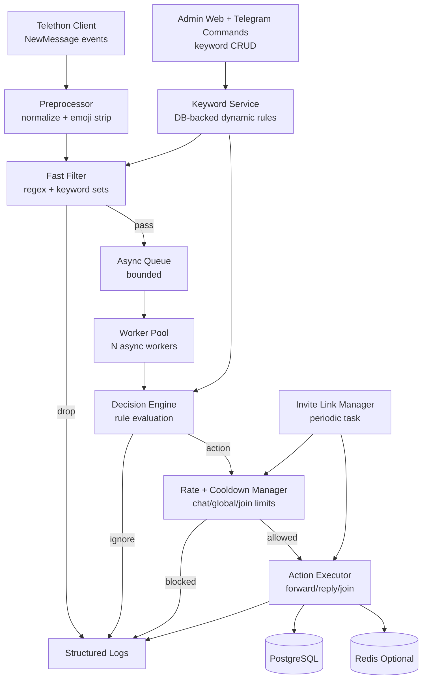

# Telegram Taxi Userbot Architecture

This system is an asynchronous event-driven pipeline optimized for low-resource servers.

## Components

1. **Telethon Ingestion**: receives messages from joined groups and pushes normalized jobs to queue.
2. **Preprocess + Fast Filter**: cheap checks first (`O(n)` text ops + compiled regex) to keep CPU/RAM low.
3. **Worker Pool**: bounded concurrency for heavier logic and action planning.
4. **Decision Engine**: forwards only taxi-order-like text:
   - `(location_pattern OR keyword_group_match)`
   - `AND not exclude_keywords`
   - `AND min_length`
5. **Rate/Cooldown**:
   - max `15 actions / hour / group`
   - max `3 replies / 10 min / group`
   - max `2 joins / day / account`
   - optional Redis backing for multi-process deployments.
6. **Action Executor**: randomized delays + typing simulation + Telethon API calls.
7. **Storage**:
   - PostgreSQL for invite links, action log, and optional message audit.
   - Redis optional for transient counters and cooldown windows.

## Runtime Characteristics

- Single process default, async tasks for all I/O.
- Bounded queue and bounded worker count to prevent memory spikes.
- Minimal dependencies for 3 CPU / 2GB RAM environment.
